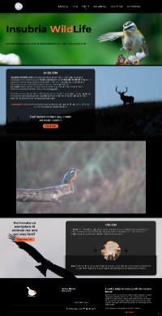

# Insubria WildLife

## Overview
A fully-working website realized for a wildlife valorization association, built using **HTML**, **SASS**, **Vite** and **Vue.js** for the Front-End, and **Laravel** for the Back-End. 

  
👀 Homepage

  

## Demo

## Technologies Used

## Functionalities

## Project Structure

## License

