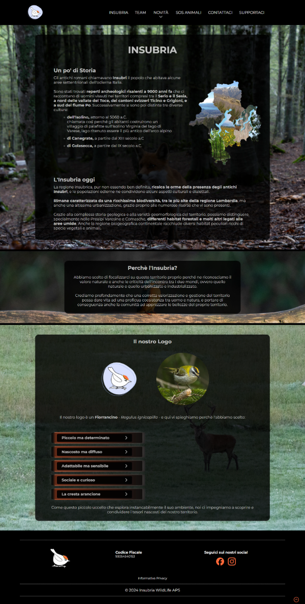
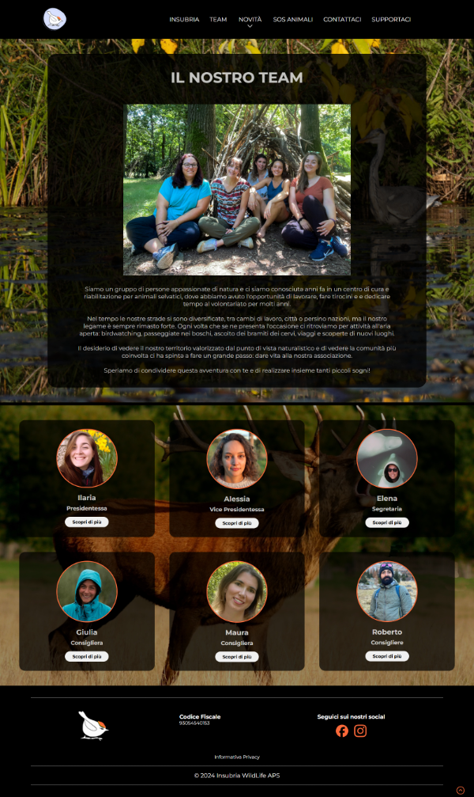
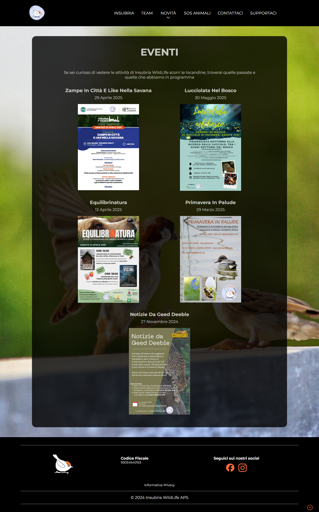
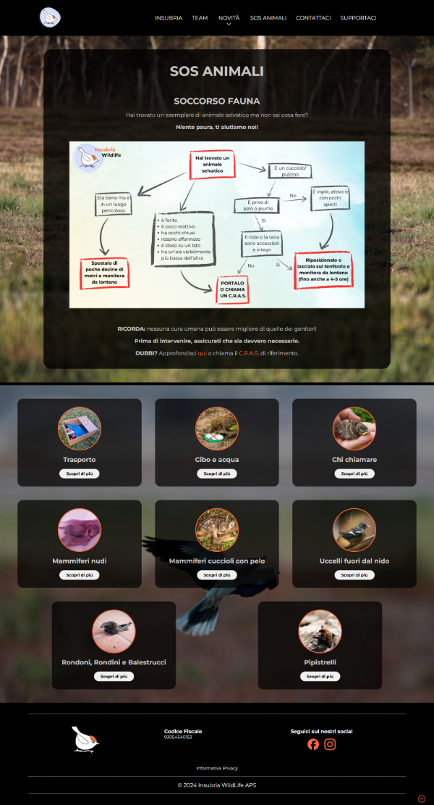
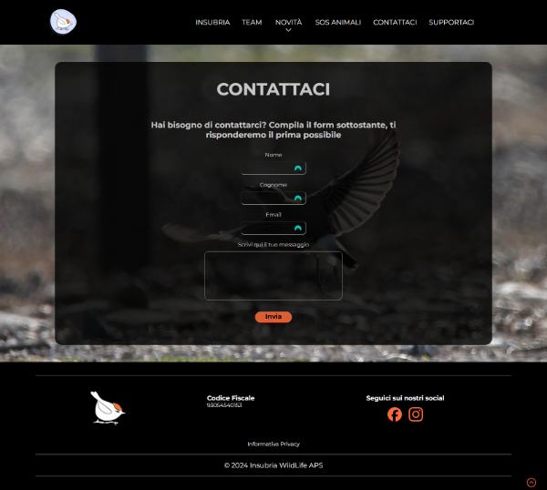
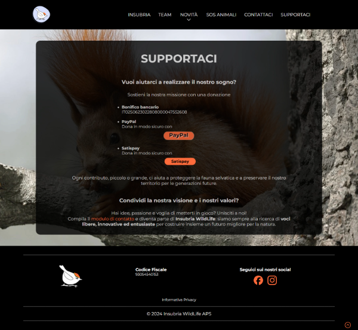

# Insubria WildLife

## Overview
A fully-working website realized for a wildlife valorization association. 

  
👀 Homepage

  

## Demo

🖼️ Here there are some screenshots of the various sections of the site.

  
  
  
  
  
  

## Technologies Used

### Front-End 🖥️
- **HTML**
- **SASS**
- **Vue.js** with **Vue Router**, **Axios**, **Vuei18n**, **FormKit**, **Vue UUID**
- **Vite**
### Back-End 📀
- **Laravel**

## Functionalities
The site has the purpose to show and explain the Insubria WildLife project, who is part of the association and what the association does, and to do that there are descriptives pages:
- **Homepage**, with a general overview on the mission and the vision.
- **Insubria**, where there's a brief history about the Insubria territory and why the _Firecrest_ has been chosen as logo.
- **Team**, that shows the various members with the single descriptions about their backgrounds.
- **Events**, with all the events oragnized by the association that took and will take place, the descriptions and all the details (place, price, date and how to participate).
- **Sos Animals**, with a map that shows the flow chart in case of an animal finding and specific descriptions based on the animal type.
- **Contact Us**, where we can find a contact form to get in touch with the team by email.
- **Support Us**, with the different payment methods to use in case of a voluntary donation.

The site is fully responsive and soon will be integrated with the language choice between italian and english and the Instagram feed.
